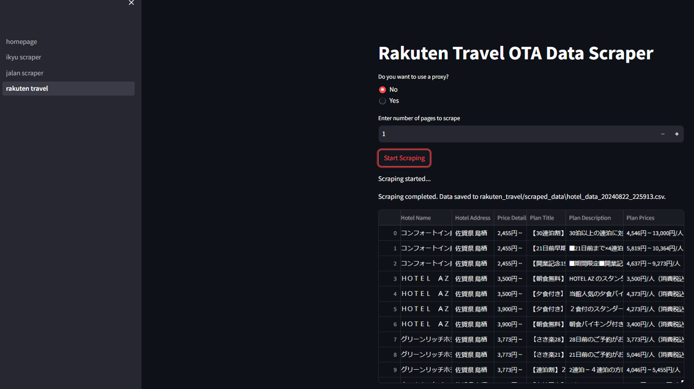
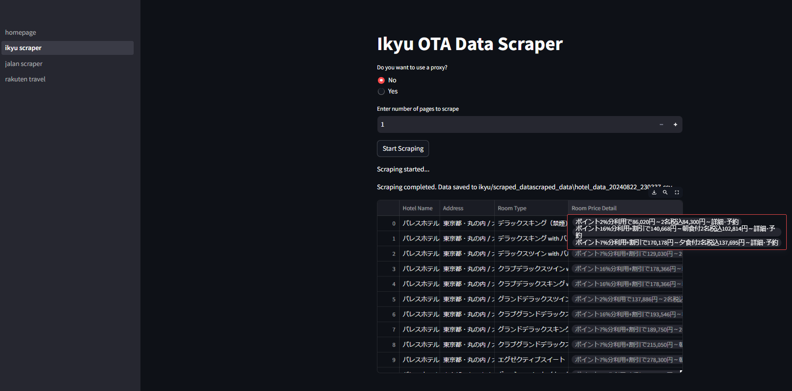
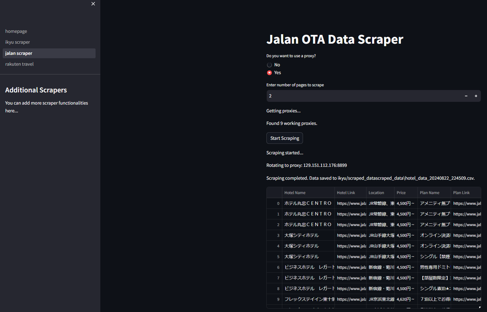

# OTA Scraper

A Streamlit-based application to scrape hotel pricing data from Ikyu, Rakuten, and Jalan, handling JavaScript rendering and implementing proxy rotation.

## Features

- Scrapes hotel data: name, location, room types, prices and more
- Handles JavaScript-rendered content Dynamically using selenium.
- Implements basic proxy rotation.
- Generates a CSV report of the scraped data as a downloadable option from the streamlit website and we can view the dataframe.

## Screenshots

### Rakuten Travel



### Ikkyu



### Jalan



## Installation

1. **Clone the repository:**

   ```sh
   git clone https://github.com/Atomic-man007/OTA_Scraper.git
   cd kabuk_assesment
   ```

2. **Set up a virtual environment (optional):**

   ```sh
   python -m venv env
   source env/bin/activate  # Windows: `env\Scripts\activate`
   ```

3. **Install dependencies:**
   ```sh
   pip install -r requirements.txt
   ```

## Usage

1. **Run the app:**
   ```sh
   streamlit run homepage.py
   ```
2. **Navigate to the URL provided by Streamlit** (usually http://localhost:8501).

3. **Use the Interface:**

   - Select the OTA website.
   - Choose the number of pages to scrape (`1-2` recommended to avoid blocking).
   - Opt to use a proxy (optional; free proxies may be unreliable).

4. **Start Scraping:** Click "Start Scraping" to begin. The scraper will open a Chrome window.

5. **Download Report:** Once scraping is complete, download the generated CSV.

6. **Data Preprocessing:** Please check the **`.ipynb`** Jupyter Notebook files in the each folder of OTA where the testing and Data Preprocessing is done using **`Regex and pandas`**.

## Project Structure

```
kabuk_assesment/
├───ikyu/
│   └───scraped_data/
├───jalan/
│   └───scraped_data/
├───pages/
└───rakuten_travel/
    └───scraped_data/
```

## Dependencies

- Python 3.8+
- Streamlit
- Selenium
- BeautifulSoup4
- Requests
- Pandas
- webdriver_manager

## Future Improvements

- Enhanced error handling for proxies.
- Support for more OTAs.
- Running scrapers on Docker and use microservice architecture etc.
- Improved scalability and speed. which can a combination of multiple libraries like scrapy, puppeteer etc.

### Approach

To scrape hotel data from the website, I used Selenium to handle dynamic content and BeautifulSoup for parsing HTML. The process involved:

1. **Navigating Pages**: Used Selenium to navigate through multiple pages by extracting the total number of pages and iterating over each page dynamically.
2. **Parsing HTML**: Employed BeautifulSoup to locate and extract relevant hotel information, including hotel name, rating, price details, and plan details etc.
3. **Storing Data**: Collected data was stored in a CSV file using pandas for structured and efficient data management.
4. **Storing Data**: Collected data was stored in a CSV and preprocessing was done in the jupyter notebook files.

### Challenges and Solutions

1. **Dynamic Content**: The website content loaded dynamically with JavaScript, which required Selenium to interact with the page and retrieve the complete HTML source.

   - **Solution**: Utilized Selenium to wait for page elements to load and fetch the page source before parsing it with BeautifulSoup.

2. **Pagination Handling**: The last page number was a string and needed to be converted to an integer to loop through pages correctly.

   - **Solution**: Extracted the last page number, converted it to an integer, and used it to guide the pagination loop.

3. **HTML Structure Variability**: Extracting structured data from various HTML tags and classes was complex.
   - **Solution**: Implemented robust error handling and checks to ensure that data extraction was reliable even when some elements were missing or had different formats.

By addressing these challenges, the code effectively scraped and structured hotel data for further analysis.
